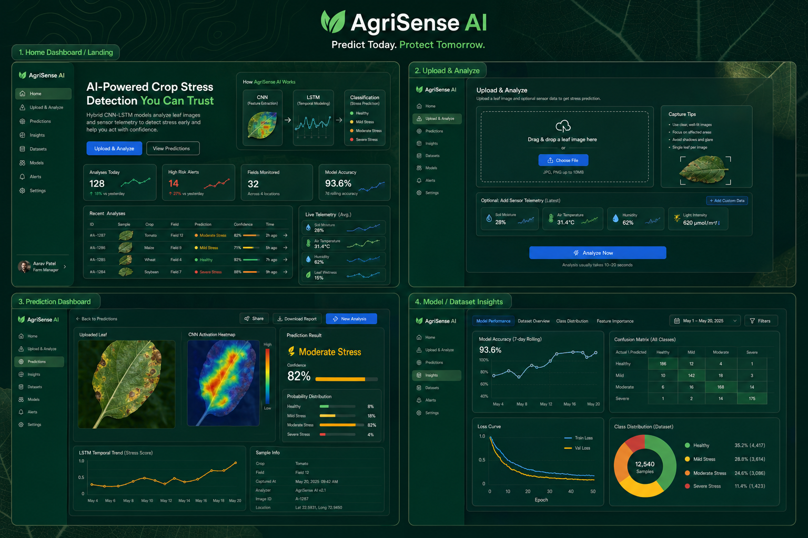

<div align="center">

# AgriSense AI

### Predict Today. Protect Tomorrow.

An end-to-end crop stress detection platform that combines one current leaf image with seven-day sensor telemetry using an image-first hybrid model.

[](https://react.dev/)
[](https://flask.palletsprojects.com/)
[](https://www.tensorflow.org/)
[](https://www.python.org/)

</div>



## Overview

AgriSense AI is a full-stack machine-learning project for analyzing plant stress as **Healthy**, **Low**, **Medium**, or **High**. A fine-tuned ImageNet-pretrained MobileNetV2 extracts stress and crop evidence from a validated leaf image, while an LSTM summarizes soil moisture, temperature, humidity, and light readings. The final probabilities use a fixed image-first 80/20 fusion so sensor telemetry provides context without overriding visible leaf evidence. A calibrated decision policy returns an honest **inconclusive** analysis when the stress evidence is not reliable enough.

The platform includes a responsive React dashboard, a Flask REST API, SQLite prediction history, reproducible dataset generation, model training and evaluation scripts, and model explainability summaries.

## Highlights

- Leaf image upload with JPG, PNG, and WebP support, plus geometry, quality, and leaf-likeness validation
- Seven-reading sensor sequence for soil moisture, temperature, humidity, and light intensity
- Fine-tuned MobileNetV2 image encoder with a nine-crop evidence head plus sensor LSTM
- Explicit 80% image / 20% sensor probability fusion
- Calibrated completed/inconclusive analyses instead of forced four-class conclusions
- Structured non-leaf, low-quality, tiny-image, and uncertain-image alerts with retry guidance
- CNN activation heatmap summaries and sensor-trend interpretation
- Prediction history and detailed result dashboards
- Dataset explorer and model-performance reports
- Reproducible training, tuning, evaluation, and inference workflows
- Responsive React UI with lazy-loaded routes and animated visualizations

## Model performance

The checked-in evaluation reports describe the current trained run:

| Metric | Result |
|---|---:|
| Full-coverage test accuracy | 91.99% |
| Macro precision | 91.58% |
| Macro recall | 92.77% |
| Macro F1 | 91.99% |
| Multiclass Brier score | 0.124 |
| Image-only macro F1 | 91.23% |
| Sensor-only macro F1 | 63.32% |
| Crop recognition accuracy | 95.45% |
| Reliable-result coverage | 78.32% |
| Reliable-result accuracy | 99.30% |
| Genuine-leaf false rejection | 2.19% |
| Deterministic non-leaf cases blocked | 5 / 5 |
| Test samples | 549 |
| Best validation accuracy | 96.30% |

The split is performed by `Plant_ID` (134 train, 29 validation, and 29 test plants), and source-image identities are checked across splits. The generated 4,764-row dataset uses each source image at most once. Evaluation also measures each modality independently and runs counterfactual image/sensor swaps; image sensitivity is 0.228 mean total variation versus 0.047 for sensors. “Reliable-result accuracy” is selective accuracy on the 78.32% of held-out windows that passed the calibrated decision policy; the remaining cases are explicitly inconclusive. See [`ml/reports`](ml/reports) for the confusion matrix, ROC curves, classification report, training history, exact probabilities, and preprocessing statistics.

## Architecture

```text
validated leaf (128 × 128 × 3) ──> fine-tuned MobileNetV2 ──> stress + crop evidence
                                                            │
image stress Softmax ──> × 0.8 ──┐                          │
                                  ├─> fusion ─> calibrated completed/inconclusive analysis
sensor LSTM Softmax ──> × 0.2 ───┘
```

```text
React + Vite frontend  <── REST/JSON ──>  Flask API  <──>  TensorFlow model
                                                │
                                                ├── SQLite history
                                                ├── Uploaded images
                                                └── Dataset/model reports
```

## Tech stack

| Layer | Technologies |
|---|---|
| Frontend | React 19, Vite, Tailwind CSS, React Router, Recharts, Framer Motion, Axios |
| Backend | Flask, Flask-CORS, Flask-SQLAlchemy, SQLite |
| Machine learning | TensorFlow/Keras, NumPy, pandas, scikit-learn, Matplotlib, Pillow |
| Model | Fine-tuned MobileNetV2, crop head, sensor LSTM, auxiliary modality heads, image-first probability fusion, reliability calibration |

## Project structure

```text
agrisense-ai/
├── backend/                 # Flask API, routes, services, database models, tests
├── dataset/                 # Sequence builder, generated CSV, schema, dataset notes
├── frontend/                # React/Vite application
├── ml/                      # Preprocessing, training, tuning, evaluation, inference
│   └── reports/             # Metrics, plots, predictions, and model metadata
└── README.md
```

## Getting started

### Prerequisites

- Python 3.10 or newer
- Node.js 20.19+ or 22.12+
- npm
- PlantVillage class folders if you want to rebuild the dataset or train the model

### 1. Clone the repository

```bash
git clone https://github.com/Gugan3007/AgriSense-AI.git
cd AgriSense-AI
```

### 2. Create the Python environment

The ML requirements include the packages needed by the API, so one environment is enough for the complete application.

```bash
python3 -m venv .venv
source .venv/bin/activate
python -m pip install --upgrade pip
python -m pip install -r ml/requirements.txt
```

### 3. Prepare the data and model

The repository includes the generated sequence CSV and evaluation reports. Raw PlantVillage images and the trained model are excluded from Git because of their size.

Place the 38 PlantVillage class directories under `dataset/plantvillage_raw/` (either directly or inside a nested `PlantVillage/` directory), then rebuild the reproducible dataset:

```bash
python dataset/build_sequences.py
```

Train and evaluate the model:

```bash
python ml/train.py
```

Training first writes a staged model and schema-v2 preprocessing/calibration contract, evaluates all four test classes, crop recognition, modality reliance, genuine-leaf acceptance, deterministic non-leaf rejection, and selective reliability, then promotes the pair to `ml/saved_model/` only when every acceptance check passes. It then refreshes `ml/reports/`. Defaults are 18 frozen-head epochs plus up to 8 fine-tuning epochs, a batch size of 16, and a sensor sequence length of 7; use `python ml/train.py --help` to see the available options.

### 4. Start the API

From the project root, in the activated virtual environment:

```bash
python backend/app.py
```

The API runs at `http://127.0.0.1:5000`. Verify it with:

```bash
curl http://127.0.0.1:5000/health
```

### 5. Start the frontend

In a second terminal:

```bash
cd frontend
npm install
npm run dev
```

Open `http://127.0.0.1:5173`.

To point the UI at a different API, create `frontend/.env.local`:

```env
VITE_API_BASE_URL=http://127.0.0.1:5000
```

## API reference

| Method | Endpoint | Purpose |
|---|---|---|
| `GET` | `/health` | API health check |
| `POST` | `/upload` | Validate a leaf image and receive an upload ID, or structured HTTP 422 guidance |
| `POST` | `/predict` | Return and persist a completed or inconclusive analysis |
| `GET` | `/history` | List paginated predictions |
| `GET` | `/history/:id` | Get a prediction and its explanation details |
| `GET` | `/dataset-info` | Get generated dataset statistics and sample rows |
| `GET` | `/model-info` | Get architecture, training, and report metadata |
| `POST` | `/contact` | Store a validated contact message |

Example prediction request after uploading an image:

```json
{
  "upload_id": "UPLOAD_ID",
  "plant_type": "Tomato",
  "recent_sensor_readings": [
    {
      "Soil_Moisture": 58.0,
      "Temperature": 25.8,
      "Humidity": 64.0,
      "Light_Intensity": 14500
    }
  ]
}
```

The API normalizes every request to seven readings. Short sequences repeat the newest value, long sequences keep the latest seven, and an omitted sequence uses the training-set means.

## Configuration

| Variable | Default | Description |
|---|---|---|
| `AGRISENSE_SECRET_KEY` | Development-only value | Flask secret key; set a strong value outside local development |
| `DATABASE_URL` | Local SQLite database | SQLAlchemy database connection string |
| `MAX_UPLOAD_MB` | `8` | Maximum upload size in megabytes |
| `CORS_ORIGINS` | Local Vite origins | Comma-separated allowed frontend origins |
| `VITE_API_BASE_URL` | `http://127.0.0.1:5000` | Frontend API base URL |

## Verification

Build the production frontend:

```bash
cd frontend
npm run build
```

After the raw images and trained model are available, run the end-to-end API smoke test from the project root:

```bash
.venv/bin/python backend/tests/smoke_test.py
```

The smoke test checks dataset/model metadata, an accepted completed analysis, a deliberately inconclusive analysis, rejection of a real non-leaf UI screenshot, persistence, and the contact endpoint.

## Dataset provenance and limitations

The dataset combines **real PlantVillage images and disease labels** with a **simulated temporal structure and sensor telemetry**. Virtual plant IDs, timestamps, image ordering, health status, stress grouping, and all sensor values are synthetic and reproducibly generated with seed `42`.

The production model consumes one uploaded leaf image and seven sensor readings, matching the training input contract. The validator is calibrated against supported PlantVillage crops and a small deterministic negative suite; it is not a general-purpose botanical detector. The timeline and telemetry are simulated because PlantVillage has no longitudinal sensor data, and the test images come from the same source domain as training. Therefore, the application is an educational/research prototype—not a field-validated diagnostic system. Its outputs should not be used as the sole basis for agricultural, treatment, safety, or financial decisions.

For the complete data statement, distributions, and rebuild instructions, read the [dataset documentation](dataset/README_dataset.md).

## Roadmap

- Validate the image-first model on independent field imagery and real telemetry
- Add authentication and per-user prediction histories
- Package model artifacts through versioned release storage
- Validate performance on independent real-world longitudinal field data
- Add automated backend and frontend CI workflows

## Contributing

Issues and pull requests are welcome. For significant changes, open an issue first to discuss the proposed behavior and include validation steps with the pull request.

---

<div align="center">
Built for transparent, reproducible crop-stress experimentation.
</div>
